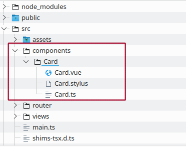
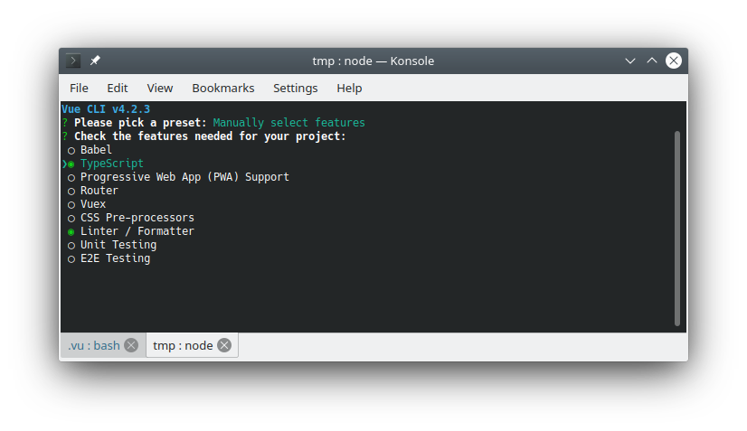

# The missing Vue.js CLI for TypeScript 😍

A Vue.js utility for TypeScript projects.

<!-- @import "[TOC]" {cmd="toc" depthFrom=1 depthTo=6 orderedList=false} -->

<!-- code_chunk_output -->

- [The missing Vue.js CLI for TypeScript 😍](#the-missing-vuejs-cli-for-typescript)
  - [Introduction](#introduction)
    - [Customizable code generation](#customizable-code-generation)
  - [Setup](#setup)
    - [Verifying](#verifying)
  - [Setting up manually](#setting-up-manually)
  - [Usage](#usage)
    - [Create a Project](#create-a-project)
    - [Generate a Component](#generate-a-component)
    - [Generate a View Component](#generate-a-view-component)
    - [Generate Component in another folder](#generate-component-in-another-folder)
    - [Run dev Server](#run-dev-server)
    - [Build release](#build-release)
    - [Get Version](#get-version)
    - [Upgrading vu](#upgrading-vu)
    - [Customizing generated code](#customizing-generated-code)
      - [Template files](#template-files)
      - [Template variable](#template-variable)

<!-- /code_chunk_output -->

## Introduction

If you're like me and code Vue.js using TypeScript, then you will find using "__vu__" will boost your productivity. It adds "sane" convenience shortcuts and generates codes like Angular CLI.

The Problem

- The Vue CLI puts everything into a single file and fails to generate code.

So I got tired of creating the files and sub-folder manually and then using snippets to generate the source code. This is when "vu" was born, it does all this with easy to use commands.

The Fix

- Separation of concern is a smart design choice, it is cleaner as the code grows.
- Create separate files for Component Class, Template and Styles.
  - Co-locate Component files under their own subfolder.
- Generate files and skeleton code, code snippets are good but gets repetitive.



### Customizable code generation

If the default generated code does not work for you, you can eject their templates and modify to suite you own needs. See [Customizing generated code](#customizing-generated-code) for more details.

Vue CLI is not enough, so I coded a Bash script to extend it, this turned into the "vu" CLI.
If you find it useful, let me know on twitter.

You can follow me: [@dev_mentor](https://twitter.com/dev_mentor)

__TIP__

When creating a TypeScript project, deselect Bable and just choose Typescript from the CLI prompt. Using Bable with Bable plugins for TypeScript is not TypeScript.

There is no advantage using both, since TypeScript is a super-set of ECMAScript and future proof.



## Setup

Before running the install script below, make sure you have the following installed:

1. Node.js
1. Git

Run the following multi-line command in your terminal.

```sh
curl https://raw.githubusercontent.com/rajinder-yadav/.vu/master/vu-setup.sh \
-o vu-setup.sh; bash ./vu-setup.sh
```

### Verifying

From the terminal, type "__vu__" and press enter. You should see the following output.

```pre
$ vu

The missing Vue.js CLI for TypeScript 😍 (v1.8.0)

Usage: vu <command> [options]

CMD     Options                 Description
===     =======                 ===========
new     <name>                  Create Vue.js Project
b                               Production build
g       c <name>                Generate Component under "components" folder
g       v <name>                Generate Component under "views" folder
g       <folder> <name>         Generate Component under declared folder
s                               Run development Server
v                               Show version

eject                           Eject code generation Templates
upgrade                         Upgrade vu script
```

## Setting up manually

If you some reason the setup command above failed. Here is how to setup up the script to work on Linux and MacOS manually.

Clone project "__vu__" under your home folder.

```sh
cd ~
git clone git@github.com:rajinder-yadav/.vu.git
```

Next add the code snippet below to "__~/.bashrc__" or "__~/.profile__".

```sh
if [ -f "${HOME}/.vu/vu.sh" ]; then
    . "${HOME}/.vu/vu.sh"
fi
```

The "__vu__" CLI makes use of Vue.js CLI to create a new project, make sure to install it.

```sh
npm install -g @vue/cli
```

## Usage

You can for the most part work with the vu CLI exclusively.

### Create a Project

Create a new Vue.js project named "hello-world".

__Note__: You will automatically be placed inside the new project folder.

```sh
vu new hello-world
```

### Generate a Component

Generate a Component called Dashboard.
Generated code will be place in the subfolder, "__src/components/Dashboard__".

```sh
vu g c Dashboard
```

### Generate a View Component

Generate a View Component called Home.
Generated code will be place in the subfolder, "__src/views/Dashboard__".

```sh
vu g v Home
```

### Generate Component in another folder

Generate a Component called Login under subfolder, "__src/Admin/Login__".

```sh
vu g Admin Login
```

### Run dev Server

Start the development server.

```sh
vu s
```

### Build release

Create a production build to deployment.

```sh
vu b
```

### Get Version

Display vu CLI version.

```sh
vu v
```

### Upgrading vu

This will update the vu CLI.

```sh
vu upgrade
```

### Customizing generated code

To customize code generation, you must first eject the template files.

```sh
vu eject
```

The ejected template files can be found under the subfolder "__.vurc__", located under your home folder.

#### Template files

There are 3 files:

- component.vu
- template.vu
- style.vu

If you want to return to using the default generated file, just delete the above mentioned files or delete the "__.vurc__" subfolder.

#### Template variable

There are currently two variables, who are substitued with their value.

Variable|Meaning
-|-
COMPONENT_NAME|Name of the Component.
CSS_EXT|File extension for the CSS style file.
